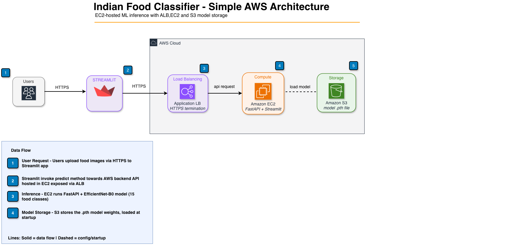

# 🍛 Indian Food Classifier on AWS

An end-to-end deep learning application that classifies 15 Indian food dishes using EfficientNet-B0, deployed on AWS with a FastAPI backend and Streamlit frontend.

## Architecture



- **Streamlit** — Frontend UI hosted on Streamlit Cloud
- **Route 53** — DNS routing to ALB (`apiindfood.theebs.cloud`)
- **ALB** — Application Load Balancer with HTTPS (ACM certificate), HTTP→HTTPS redirect
- **EC2** — `t3.small` running Docker container with FastAPI + Uvicorn
- **S3** — Stores the trained EfficientNet model weights

## Supported Classes (15)

Idli, Masala Dosa, Dhokla, Paani Puri, Pakode, Chai, Samosa, Pav Bhaji, Fried Rice, Jalebi, Butter Naan, Kadai Paneer, Kulfi, Chapati, Chole Bhature

## Model Performance

| Model | Test Accuracy |
|-------|--------------|
| MLP | 13.35% |
| CNN | 58.95% |
| **EfficientNet-B0** | **90.91%** |

## Project Structure

```
├── app/
│   ├── __init__.py
│   └── model.py            # Model loading & inference
├── infra/
│   └── template.yaml       # CloudFormation template
├── model/
│   └── indianfood.ipynb    # Training notebook
├── main.py                 # FastAPI application
├── streamlit_app.py        # Streamlit frontend
├── Dockerfile
├── docker-compose.yml
└── requirements.txt
```

## API Endpoints

| Method | Path | Description |
|--------|------|-------------|
| GET | `/` | Health message |
| GET | `/health` | Health check (used by ALB) |
| POST | `/predict` | Classify food image |

## API Usage

### POST /predict

**Request:** multipart/form-data with `file` field

```bash
curl -X POST https://apiindfood.theebs.cloud/predict \
  -F "file=@indian-food.jpg"
```

**Response:**
```json
{
  "prediction": "masala_dosa",
  "confidence": 0.95,
  "top3": [
    {"class": "masala_dosa", "confidence": 0.95},
    {"class": "dhokla", "confidence": 0.02},
    {"class": "idli", "confidence": 0.01}
  ],
  "all_probs": { ... }
}
```

### Testing with Postman

1. Method: **POST**
2. URL: `https://apiindfood.theebs.cloud/predict`
3. Body → **form-data**
4. Key: `file` (type: File) → select your image

## Infrastructure (CloudFormation)

The `infra/template.yaml` provisions:

| Resource | Purpose |
|----------|---------|
| ALB + HTTPS Listener | Internet-facing load balancer with ACM cert |
| HTTP Listener | Redirects HTTP → HTTPS (301) |
| EC2 Instance | Runs Dockerized FastAPI app |
| Security Groups | ALB allows 80/443 from internet; EC2 allows 8000 from ALB only |
| S3 Bucket | Encrypted model storage |
| IAM Role | EC2 access to S3 model + SSM |
| ACM Certificate | DNS-validated TLS for `apiindfood.theebs.cloud` |
| Route 53 Record | Alias A record pointing to ALB |

### Deploy

```bash
# 1. Upload model to S3
aws s3 cp model/efficientnet_indian_food.pth s3://<stack-name>-model-<account-id>/efficientnet_indian_food.pth

# 2. Deploy stack
aws cloudformation deploy \
  --template-file infra/template.yaml \
  --stack-name indian-food-classifier \
  --capabilities CAPABILITY_IAM
```

## Local Development

```bash
# Run with Docker Compose
docker-compose up -d

# FastAPI: http://localhost:8001
# Streamlit: http://localhost:8502
```

## Tech Stack

- **ML:** PyTorch, EfficientNet-B0, torchvision
- **Backend:** FastAPI, Uvicorn
- **Frontend:** Streamlit, Plotly
- **Infra:** AWS (EC2, ALB, S3, Route 53, ACM, CloudFormation)
- **Container:** Docker, Docker Compose
